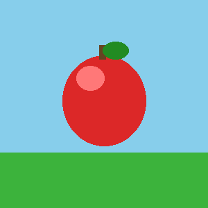

# cutout-image

## What's this?

cutout-image : ‰æ‘œ‚ğ�؂蔲‚­ƒc�[ƒ‹‚Å‚·�B

## Prerequisite

 - Python<3.14 is required

## Preparation for Windows environment

```bash
python -m venv venv
venv\Scripts\activate
pip install -r requirements.txt
```

## Execution

(This takes few miniutes)

```bash
python cutout.py test_apple.png
```

## Example

### test_apple.png



### test_apple_result.png


